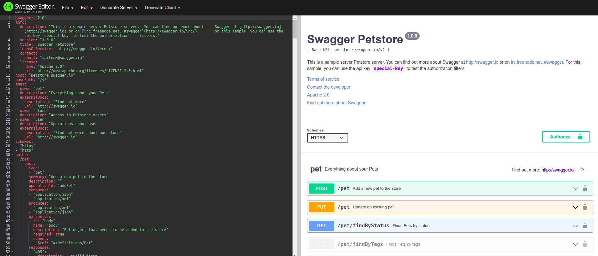
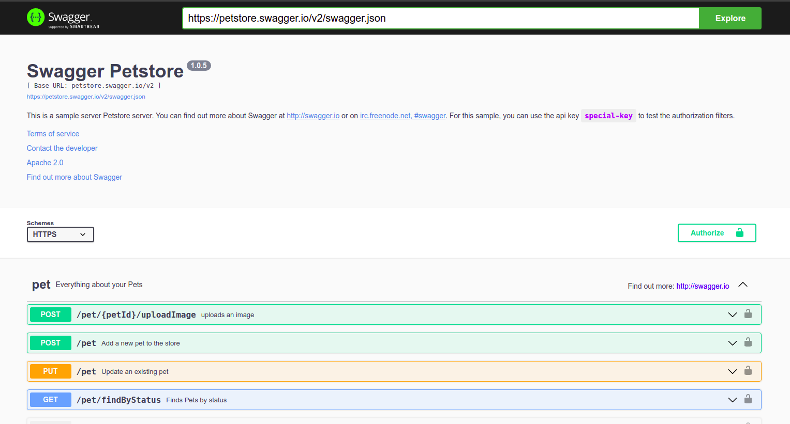

# Treinamento Alura: Swagger

## Sobre

````
O Swagger fornece um conjunto de ferramentas, dentre eles: 
Swagger Editor para escrevermos a documentação da API, 
Swagger UI para disponibilizarmos essa documentação e Swagger Codegen 
para gerar código a partir da documentação.

Ele segue a openAPI Specification - Utilizei a versão 3.0 nesse curso
Online - https://editor.swagger.io/

Devo colocar as respostas possíveis para cada chamada

/especialidades/{id} -> Recebe parametro na url
in: path

Components: Para reutilizar
components:
  schemas:
    Especialidade:
      type: object
      properties:
        id:
          type: integer
        descricao:
          type: string
    Especialidades:
      type: array
      items:
        $ref: "#/components/schemas/Especialidade"

schema: <- Reutilizando
    $ref: "#/components/schemas/Especialidade"
    
Segurança Auth: Ativa o envio do token no bearer
security: 
- auth: []

https://swagger.io/specification/#data-types <- Tipos de dados

Run Editor: ($(pwd) = Minha pasta) - Gera o arquivo
http://localhost/
cd swagger-editor 
docker run -p 80:8080 -v $(pwd):/tmp -e SWAGGER_FILE=/tmp/openapi.yml swaggerapi/swagger-editor

Run Ui: Coloca no ar para o Cliente
cd swagger-editor
docker run -p 80:8080 -e SWAGGER_JSON=/tmp/openapi.json -v $(pwd):/tmp swaggerapi/swagger-ui
````

## Install
````
https://github.com/swagger-api/swagger-editor
docker pull swaggerapi/swagger-editor

https://github.com/swagger-api/swagger-ui/blob/master/docs/usage/installation.md
docker pull swaggerapi/swagger-ui
````


